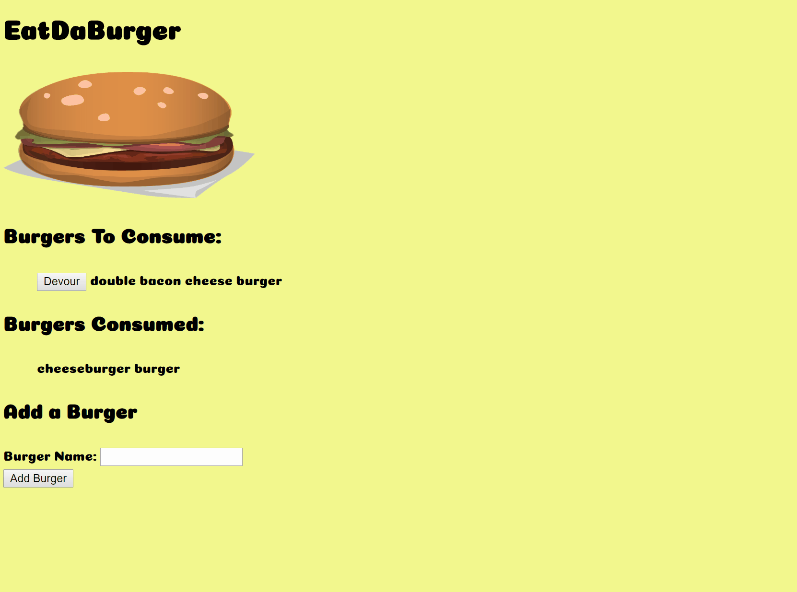

# EatDaBurger

This is a burger logger with MySQL, Node, Express, Handlebars and a homemade ORM (yum!). This uses the MVC design pattern; using Node and MySQL to query and route data, and Handlebars (templating software) to generate the HTML.

## Getting Started

Click here and you will be taken to the app,  [EatDaBurger](https://nameless-savannah-23342.herokuapp.com/). Enjoy!

## Built With

* [JS](https://developer.mozilla.org/en-US/docs/Web/JavaScript) - High-level programming language.
* [Node.js](https://nodejs.org/en/) - Open-source run-time environment that executes JS code outside of a browser.
* [npm](https://www.npmjs.com/) - npm is a package manager for the JavaScript programming language.
* [Express.js](https://expressjs.com/) - Web application framework for Node.js.
* [VSC](https://code.visualstudio.com/) - Visual Studio Code is a source code editor developed by Microsoft.
* [MySQL](https://www.mysql.com/products/workbench/) - Visual tool for database architects.
* [Heroku](https://heroku.com) - Heroku is a cloud platform as a service supporting several programming languages.
* [Handlebars.js](https://handlebarsjs.com) - Templating engine.  It is based on the Mustache template language.
* [JawsDB MySQL](https://elements.heroku.com/addons/jawsdb) - Add-on for providing a fully functional MySQL Database server for use with Heroku application

## Challenges

This application uses the MVC architecture and a handmade ORM, no sequalize in this one. Getting to understand the flow of data inside of the MVC architecture was the biggest challenge. Also deploying the app and the database was also an interesting challenge to overcome. Thanks to JawsDB it was a much easier task.

## Authors

* **Timothy Charette** - *Initial work* - [Github](https://github.com/charettetimothy)

## Acknowledgments

* Hat tip to anyone whose code was used.

